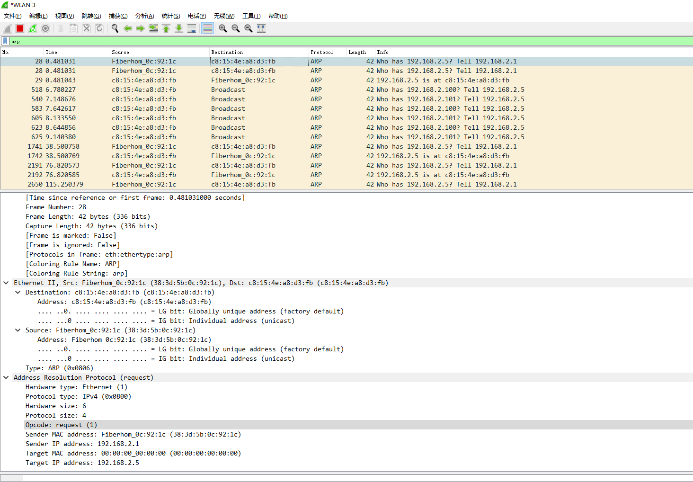
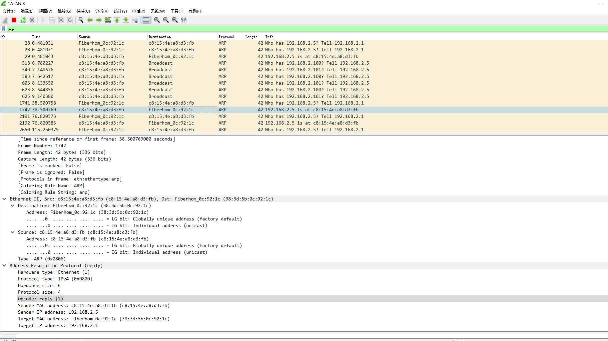

# Day002：网络与协议基础 - 以太网、MAC 与 ARP

- 日期：2025-12-26
- 周次：第1周

## 学习目标
- 理解二层寻址（MAC）与 ARP 的工作流程
- 认识广播域与交换机学习机制（理论）

## 学习内容

### 1️⃣ 以太网（Ethernet）基础

**以太网**是最常用的局域网技术，工作在 OSI 的数据链路层（第2层）。

**以太网帧结构：**
```
┌──────────────┬──────────────┬──────┬─────────┬─────┐
│ 目标MAC地址  │ 源MAC地址    │ 类型 │ 数据    │ FCS │
│   6字节      │   6字节      │2字节 │46-1500字节│4字节│
└──────────────┴──────────────┴──────┴─────────┴─────┘
```

- **类型字段**：0x0800 = IPv4，0x0806 = ARP
- **FCS**：帧校验序列，检测传输错误

### 2️⃣ MAC 地址详解

**MAC 地址（Media Access Control Address）** - 网卡的物理地址

**特点：**
- **长度**：48 位（6 字节），写成 12 个十六进制数
- **格式**：`C8-15-4E-A8-D3-FB` 或 `C8:15:4E:A8:D3:FB`
- **前 3 字节**：OUI（厂商标识）
- **后 3 字节**：厂商分配的序列号

**特殊 MAC 地址：**
- **广播地址**：`FF-FF-FF-FF-FF-FF`（所有设备接收）
- **多播地址**：第一字节最低位为 1，如 `01-00-5e-xx-xx-xx`

### 3️⃣ ARP 协议（Address Resolution Protocol）

**ARP 的作用：将 IP 地址转换为 MAC 地址**

**为什么需要 ARP？**
- 网络层使用 IP 地址（如 192.168.2.5）
- 数据链路层使用 MAC 地址（如 C8-15-4E-A8-D3-FB）
- ARP 负责在两者之间建立映射

**ARP 工作流程：**
```
主机 A (192.168.2.5) 想要发送数据给主机 B (192.168.2.10)

步骤 1: A 检查 ARP 缓存
  └─ 如果没有 192.168.2.10 的 MAC → 发送 ARP 请求

步骤 2: A 发送 ARP 请求（广播）
  ┌────────────────────────────────────┐
  │ 谁有 192.168.2.10？               │
  │ 请告诉 192.168.2.5                │
  │ 我的 MAC 是 C8-15-4E-A8-D3-FB     │
  │ 目标 MAC: FF-FF-FF-FF-FF-FF（广播）│
  └────────────────────────────────────┘
       ↓ 局域网所有设备都收到

步骤 3: 主机 B 回复 ARP 应答（单播）
  ┌────────────────────────────────────┐
  │ 我是 192.168.2.10                 │
  │ 我的 MAC 是 AA-BB-CC-DD-EE-FF     │
  │ 目标 MAC: C8-15-4E-A8-D3-FB       │
  └────────────────────────────────────┘
       ↓ 单播回复给主机 A

步骤 4: A 将映射存入 ARP 缓存
  192.168.2.10 → AA-BB-CC-DD-EE-FF
```

**ARP 报文结构：**
```
字段名称              说明                      值（请求/应答）
────────────────────────────────────────────────────────────
硬件类型              1 = 以太网                1
协议类型              0x0800 = IPv4             0x0800
硬件地址长度          MAC 地址长度              6
协议地址长度          IP 地址长度               4
操作码                1=请求, 2=应答            1 或 2
发送者 MAC 地址       发送者的物理地址          实际 MAC
发送者 IP 地址        发送者的 IP               实际 IP
目标 MAC 地址         目标的物理地址            00-00-00-00-00-00 (请求)
目标 IP 地址          目标的 IP                 查询的 IP
```

### 4️⃣ 交换机工作原理

**交换机（Switch）** 根据 MAC 地址转发数据帧。

**MAC 地址表（CAM 表）示例：**
```
端口    MAC 地址              学习时间
────────────────────────────────────
1       C8-15-4E-A8-D3-FB     10秒前
2       AA-BB-CC-DD-EE-FF     5秒前
3       11-22-33-44-55-66     2秒前
```

**转发决策：**
```
收到数据帧时：
1. 学习源 MAC → 记录来自哪个端口
2. 查找目标 MAC：
   ├─ 在表中找到 → 单播转发到对应端口
   ├─ 广播地址 → 洪泛到所有端口
   └─ 找不到 → 洪泛到所有端口（除接收端口）
```

**广播域（Broadcast Domain）：**
- 广播帧能到达的所有设备范围
- 同一交换机下的所有端口在同一广播域
- 路由器可以隔离广播域

### 5️⃣ ARP 安全问题（理论）

⚠️ **ARP 欺骗/中间人攻击：**
- ARP 没有认证机制
- 攻击者可发送伪造的 ARP 应答
- 劫持或窃听流量

**防护措施：**
- 静态 ARP 条目（关键设备）
- ARP 防护软件
- 交换机 DAI（Dynamic ARP Inspection）

## 实践任务（合法授权范围内）

### 📦 任务准备：安装 Wireshark

**方法 1：使用 Winget 安装**
```powershell
winget install -e --id WiresharkFoundation.Wireshark
```

**方法 2：手动下载安装**
- 访问：https://www.wireshark.org/download.html
- 下载：Windows Installer (64-bit)
- 安装时勾选：Npcap（网络抓包驱动）

### 🎯 任务 1: 使用 Wireshark 抓取本地 ARP 流量

**步骤 1：启动 Wireshark**
```powershell
# 启动 Wireshark（安装后）
wireshark
```

**步骤 2：选择网络接口**
- 双击你的活动网络接口（如：Wi-Fi、以太网）
- 提示：有流量活动的接口会显示实时图表

**步骤 3：设置显示过滤器**
- 在顶部过滤栏输入：`arp`
- 按 Enter 键应用过滤器
- 只显示 ARP 协议的数据包

**步骤 4：生成 ARP 流量**

在 PowerShell 中执行以下命令（触发 ARP 请求）：
```powershell
# 清空 ARP 缓存（需要管理员权限）
# 如果没有管理员权限，可以跳过此步骤

# Ping 网关以触发 ARP
ping -n 2 192.168.2.1

# Ping 同网段其他 IP（可能不存在，但会触发 ARP）
ping -n 1 192.168.2.100
ping -n 1 192.168.2.101
```

**步骤 5：分析 ARP 数据包**

在 Wireshark 中，你会看到两种类型的 ARP 包：

**ARP 请求包（Request）特征：**
```
Info: Who has 192.168.2.1? Tell 192.168.2.5
```

**ARP 应答包（Reply）特征：**
```
Info: 192.168.2.1 is at 38:3d:5b:0c:92:1c
```

**步骤 6：详细字段标注**

点击一个 ARP 请求包，在中间窗格展开字段：

### 📊 ARP 请求包字段标注

```
Frame（帧信息）
├─ Ethernet II（以太网帧头）
│  ├─ Destination: ff:ff:ff:ff:ff:ff（广播 MAC）
│  ├─ Source: c8:15:4e:a8:d3:fb（本机 MAC）
│  └─ Type: ARP (0x0806)（协议类型）
│
└─ Address Resolution Protocol (request)
   ├─ Hardware type: Ethernet (1)（硬件类型：以太网）
   ├─ Protocol type: IPv4 (0x0800)（协议类型：IPv4）
   ├─ Hardware size: 6（MAC 地址长度）
   ├─ Protocol size: 4（IP 地址长度）
   ├─ Opcode: request (1)（操作码：请求）
   ├─ Sender MAC address: c8:15:4e:a8:d3:fb（发送者 MAC）
   ├─ Sender IP address: 192.168.2.5（发送者 IP）
   ├─ Target MAC address: 00:00:00:00:00:00（目标 MAC，未知）
   └─ Target IP address: 192.168.2.1（目标 IP，要查询的）
```

### 📊 ARP 应答包字段标注

```
Frame（帧信息）
├─ Ethernet II（以太网帧头）
│  ├─ Destination: c8:15:4e:a8:d3:fb（请求者 MAC，单播）
│  ├─ Source: 38:3d:5b:0c:92:1c（网关 MAC）
│  └─ Type: ARP (0x0806)
│
└─ Address Resolution Protocol (reply)
   ├─ Hardware type: Ethernet (1)
   ├─ Protocol type: IPv4 (0x0800)
   ├─ Hardware size: 6
   ├─ Protocol size: 4
   ├─ Opcode: reply (2)（操作码：应答）
   ├─ Sender MAC address: 38:3d:5b:0c:92:1c（网关 MAC，已知）
   ├─ Sender IP address: 192.168.2.1（网关 IP）
   ├─ Target MAC address: c8:15:4e:a8:d3:fb（请求者 MAC）
   └─ Target IP address: 192.168.2.5（请求者 IP）
```

**关键区别对比：**

| 字段 | ARP 请求 | ARP 应答 |
|------|---------|---------|
| **以太网目标 MAC** | FF:FF:FF:FF:FF:FF（广播）| C8:15:4E:A8:D3:FB（单播）|
| **操作码** | 1（request）| 2（reply）|
| **目标 MAC** | 00:00:00:00:00:00（未知）| C8:15:4E:A8:D3:FB（已知）|

**步骤 7：保存抓包文件**
- File → Save As
- 保存为：`day002_arp_capture.pcapng`
- 可以随时重新打开分析

### 🎯 任务 2: 观察 ARP 缓存（已完成）

```powershell
arp -a
```
（此任务已在上面完成）

## 巩固练习（题与复盘）
- 问答：为何需要 ARP？它解决了什么问题？
- 练习：识别抓包中 ARP 的请求/应答并解释发送者/目标字段

## 评估标准（达成判定）
- 能在抓包中准确定位与解释 ARP 报文
- 能说明 ARP 工作原理与安全注意事项（仅理论）

## 学习成果达成情况（由学习者填写）

### 📋 实践任务完成情况

**任务 1: 查看 ARP 缓存**
- 关键命令与输出：
  ```powershell
  arp -a
  
  接口: 192.168.2.5 --- 0x13
    Internet 地址         物理地址              类型
    192.168.2.1           38-3d-5b-0c-92-1c     动态        
    192.168.2.255         ff-ff-ff-ff-ff-ff     静态
    224.0.0.22            01-00-5e-00-00-16     静态
    224.0.0.251           01-00-5e-00-00-fb     静态
    224.0.0.252           01-00-5e-00-00-fc     静态
    239.255.255.250       01-00-5e-7f-ff-fa     静态
    255.255.255.255       ff-ff-ff-ff-ff-ff     静态
  ```

**ARP 缓存条目分析：**

| IP 地址 | MAC 地址 | 类型 | 说明 |
|---------|----------|------|------|
| 192.168.2.1 | 38-3d-5b-0c-92-1c | 动态 | **网关/路由器** - 访问互联网的必经之路 |
| 192.168.2.255 | ff-ff-ff-ff-ff-ff | 静态 | 子网广播地址 |
| 224.0.0.251 | 01-00-5e-00-00-fb | 静态 | mDNS 多播地址（本地服务发现）|
| 239.255.255.250 | 01-00-5e-7f-ff-fa | 静态 | SSDP 多播地址（UPnP 设备发现）|
| 255.255.255.255 | ff-ff-ff-ff-ff-ff | 静态 | 全网广播地址 |

**关键发现：**
- ✅ 动态条目只有网关（192.168.2.1），说明最近只与网关通信
- ✅ 多播地址以 `01-00-5e` 开头，这是 IPv4 多播 MAC 的标准格式
- ✅ 广播 MAC 地址是 `ff-ff-ff-ff-ff-ff`

---

**任务 2: Wireshark 抓取 ARP 流量（已完成）** ✅

**实践操作：**
1. ✅ 启动 Wireshark 并选择 WLAN 3 接口
2. ✅ 设置显示过滤器：`arp`
3. ✅ 执行 `ping 192.168.2.1` 生成 ARP 流量
4. ✅ 成功捕获 ARP 请求和应答包
5. ✅ 分析了数据包的详细字段

**📸 实践截图：**

**截图 1: ARP 请求包（广播）**

- Frame 540：ARP 请求包
- 目标 MAC: ff:ff:ff:ff:ff:ff（广播）
- 操作码: request (1)
- 目标 MAC 地址字段为 00:00:00:00:00:00（未知）

**截图 2: ARP 应答包（单播）**

- Frame 1742：ARP 应答包
- 目标 MAC: c8:15:4e:a8:d3:fb（单播回复给请求者）
- 操作码: reply (2)
- 发送者 MAC: 38:3d:5b:0c:92:1c（网关 Fiberhom）

**捕获到的 ARP 包分析：**

**📦 ARP 请求包 (Request) - Frame 540：**
```
以太网帧头：
├─ 源 MAC: c8:15:4e:a8:d3:fb（本机 MAC）
├─ 目标 MAC: ff:ff:ff:ff:ff:ff（广播地址）
└─ 类型: ARP (0x0806)

ARP 报文：
├─ 硬件类型: Ethernet (1)
├─ 协议类型: IPv4 (0x0800)
├─ 硬件地址长度: 6 字节
├─ 协议地址长度: 4 字节
├─ 操作码: request (1) ← 这是请求
├─ 发送者 MAC: c8:15:4e:a8:d3:fb
├─ 发送者 IP: 192.168.2.5（我的 IP）
├─ 目标 MAC: 00:00:00:00:00:00（未知，需要查询）
└─ 目标 IP: 192.168.2.1（网关 IP）

含义："我是 192.168.2.5，谁有 192.168.2.1？告诉我你的 MAC！"
```

**📦 ARP 应答包 (Reply) - Frame 1742：**
```
以太网帧头：
├─ 源 MAC: 38:3d:5b:0c:92:1c（网关 MAC - Fiberhom）
├─ 目标 MAC: c8:15:4e:a8:d3:fb（本机 MAC，单播）
└─ 类型: ARP (0x0806)

ARP 报文：
├─ 硬件类型: Ethernet (1)
├─ 协议类型: IPv4 (0x0800)
├─ 硬件地址长度: 6 字节
├─ 协议地址长度: 4 字节
├─ 操作码: reply (2) ← 这是应答
├─ 发送者 MAC: c8:15:4e:a8:d3:fb（我的 MAC）
├─ 发送者 IP: 192.168.2.5（我的 IP）
├─ 目标 MAC: 38:3d:5b:0c:92:1c（网关 MAC）
└─ 目标 IP: 192.168.2.1（网关 IP）

含义："我是 192.168.2.1，我的 MAC 是 38:3d:5b:0c:92:1c"
```

**🔍 关键观察与验证：**

| 对比项 | ARP 请求 | ARP 应答 | 验证结果 |
|--------|---------|---------|----------|
| **以太网目标 MAC** | ff:ff:ff:ff:ff:ff（广播）| c8:15:4e:a8:d3:fb（单播）| ✅ 符合理论 |
| **ARP 操作码** | 1 (request) | 2 (reply) | ✅ 正确 |
| **ARP 目标 MAC** | 00:00:00:00:00:00（未知）| 38:3d:5b:0c:92:1c（已知）| ✅ 符合预期 |
| **帧长度** | 42 bytes | 42 bytes | ✅ ARP 包固定大小 |
| **网关厂商** | - | Fiberhom | 📝 光纤设备厂商 |

**💡 实践收获：**
1. ✅ 亲眼看到了 ARP 请求使用广播 (ff:ff:ff:ff:ff:ff)
2. ✅ 验证了 ARP 应答使用单播直接回复给请求者
3. ✅ 理解了"谁有 IP？告诉 MAC"的实际过程
4. ✅ 观察到了真实网络中的 MAC 地址和厂商信息
5. ✅ 掌握了 Wireshark 的基本使用方法

### 📝 巩固练习答案

**练习 1: 为何需要 ARP？它解决了什么问题？**

**答案：**
ARP 解决了**网络层地址（IP）到数据链路层地址（MAC）的映射问题**。

**原因：**
1. **网络层使用 IP 地址**：应用程序和路由使用 IP 地址（如 192.168.2.10）进行通信
2. **数据链路层使用 MAC 地址**：以太网帧必须使用 MAC 地址（如 AA-BB-CC-DD-EE-FF）才能在局域网传输
3. **需要转换机制**：当主机知道目标 IP 但不知道 MAC 时，无法发送以太网帧

**ARP 的作用：**
- 发送广播询问："谁有这个 IP？请告诉我你的 MAC"
- 目标主机回复："我有这个 IP，我的 MAC 是..."
- 建立 IP ↔ MAC 映射，缓存起来供后续使用

**类比：** IP 地址像家庭住址（用于导航），MAC 地址像门牌号（用于实际投递），ARP 就是查找门牌号的过程。

---

**练习 2: 识别 ARP 请求/应答并解释字段**

**ARP 请求报文示例：**
```
操作码: 1 (请求)
发送者 MAC: C8-15-4E-A8-D3-FB  ← 我的 MAC（已知）
发送者 IP:  192.168.2.5        ← 我的 IP（已知）
目标 MAC:   00-00-00-00-00-00  ← 要查询的 MAC（未知，填0）
目标 IP:    192.168.2.1        ← 要查询的 IP（已知）

以太网帧头：
源 MAC:     C8-15-4E-A8-D3-FB
目标 MAC:   FF-FF-FF-FF-FF-FF  ← 广播，所有设备都收到
```

**解释：**
- "我是 192.168.2.5 (MAC: C8-15-4E-A8-D3-FB)"
- "谁有 192.168.2.1？请告诉我你的 MAC 地址"
- 使用广播发送，局域网内所有设备都能收到

**ARP 应答报文示例：**
```
操作码: 2 (应答)
发送者 MAC: 38-3d-5b-0c-92-1c  ← 网关的 MAC（被查询者）
发送者 IP:  192.168.2.1        ← 网关的 IP（被查询者）
目标 MAC:   C8-15-4E-A8-D3-FB  ← 请求者的 MAC
目标 IP:    192.168.2.5        ← 请求者的 IP

以太网帧头：
源 MAC:     38-3d-5b-0c-92-1c
目标 MAC:   C8-15-4E-A8-D3-FB  ← 单播回复，只发给请求者
```

**解释：**
- "我是 192.168.2.1，我的 MAC 是 38-3d-5b-0c-92-1c"
- "这是你要的信息，发送给 192.168.2.5"
- 使用单播回复，只有请求者收到

### ✅ 结论与反思

**核心知识点掌握：**
1. ✅ **MAC 地址**：48 位物理地址，全球唯一，用于局域网内数据传输
2. ✅ **ARP 协议**：IP → MAC 的映射机制，使用"广播请求 + 单播应答"
3. ✅ **ARP 缓存**：保存 IP-MAC 映射，动态条目有超时时间
4. ✅ **广播域**：同一交换机下所有设备在同一广播域，ARP 请求会被所有设备接收
5. ✅ **交换机**：根据 MAC 地址表转发，学习源 MAC，查找目标 MAC

**实践理解：**
- 本机 ARP 缓存中只有网关的动态条目，说明通常只需要与网关通信
- 访问互联网时：本机 → 网关（MAC 转发）→ 网关（IP 路由）→ 互联网
- ARP 只在局域网内工作，跨网段通信通过路由器的 IP 路由实现

**数据流转过程：**
```
访问百度 (220.181.38.148) 的过程：
1. 检查目标 IP 220.181.38.148 不在本地网段（192.168.2.0/24）
2. 查找路由表，确定需要发给默认网关 192.168.2.1
3. 查 ARP 缓存，获取网关 MAC: 38-3d-5b-0c-92-1c
4. 构造以太网帧：
   - 目标 MAC: 38-3d-5b-0c-92-1c（网关）
   - 源 MAC: C8-15-4E-A8-D3-FB（本机）
   - IP 包内：目标 IP: 220.181.38.148（百度）
5. 网关收到后，剥离以太网帧，根据 IP 路由转发
```

**安全思考：**
- ⚠️ ARP 无认证，易受欺骗攻击
- 🛡️ 关键设备应使用静态 ARP
- 🔍 异常 ARP 流量可能是攻击信号
