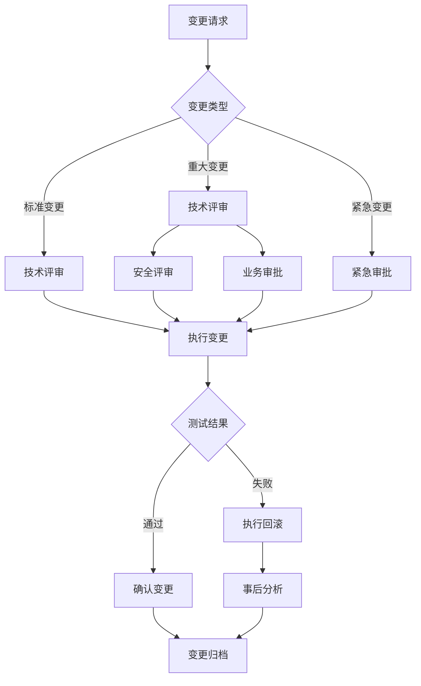

# Day027：漏洞扫描与基线 - 加固复验与变更记录

- 日期：2026-01-20
- 周次：第4周

## 学习目标

今天你将掌握：

- **建立复验流程**：验证安全加固措施是否生效
- **形成变更记录**：规范记录配置变更，便于审计和回溯
- **理解回归风险**：评估加固措施对业务功能的影响
- **制定回滚策略**：在加固失败时快速恢复原配置
- **掌握变更管理**：理解企业级变更审批流程

---

## 学习内容

### 1️⃣ 加固复验的重要性

#### 1.1 为什么需要复验？

```
加固后必须复验
├─ 确认措施生效（配置是否生效？）
├─ 检测副作用（是否影响业务？）
├─ 验证无误报（扫描器误判已修复？）
└─ 建立基线（作为后续对比基准）
```

**常见问题**：

| 场景 | 问题 | 后果 |
|------|------|------|
| 配置错误 | 语法错误导致服务无法启动 | 🔴 服务中断 |
| 过度加固 | 禁用必要功能导致业务异常 | 🟠 功能失效 |
| 未生效 | 重启服务时配置未加载 | 🟡 漏洞仍存在 |
| 误报 | 扫描器误判，实际无需加固 | 🟢 虚惊一场 |

#### 1.2 复验流程

```
┌─────────────────────────────────────────────────────┐
│ 1. 加固前基线扫描（Baseline Scan）                 │
│    - 记录初始状态                                   │
│    - 保存配置备份                                   │
│    - 记录服务正常运行状态                           │
└─────────────────────────────────────────────────────┘
                         ↓
┌─────────────────────────────────────────────────────┐
│ 2. 执行安全加固                                     │
│    - 修改配置文件                                   │
│    - 重启服务                                       │
│    - 基础功能测试                                   │
└─────────────────────────────────────────────────────┘
                         ↓
┌─────────────────────────────────────────────────────┐
│ 3. 加固后复验扫描（Re-scan）                        │
│    - 执行相同扫描任务                               │
│    - 对比前后结果                                   │
│    - 验证措施是否生效                               │
└─────────────────────────────────────────────────────┘
                         ↓
┌─────────────────────────────────────────────────────┐
│ 4. 业务回归测试                                     │
│    - 测试核心业务功能                               │
│    - 验证用户访问是否正常                           │
│    - 检查日志无异常                                 │
└─────────────────────────────────────────────────────┘
                         ↓
┌─────────────────────────────────────────────────────┐
│ 5. 确认或回滚                                     │
│    ├─ 测试通过 → 确认变更，更新文档                 │
│    └─ 测试失败 → 立即回滚，分析原因                 │
└─────────────────────────────────────────────────────┘
```

---

### 2️⃣ 复验方法与对比技术

#### 2.1 配置文件对比

**使用 `diff` 命令对比配置变化**：

```bash
# 备份原配置
sudo cp /etc/nginx/nginx.conf /etc/nginx/nginx.conf.backup_$(date +%Y%m%d)

# 修改配置...
sudo nano /etc/nginx/nginx.conf

# 对比配置变化
diff /etc/nginx/nginx.conf.backup_20260119 /etc/nginx/nginx.conf
```

**输出示例**：

```diff
--- nginx.conf.backup_20260119   2026-01-19 10:00:00
+++ nginx.conf                   2026-01-19 10:30:00
@@ -12,6 +12,9 @@
 
 http {
     include       /etc/nginx/mime.types;
+    server_tokens off;
+    add_header X-Frame-Options "SAMEORIGIN" always;
+    add_header X-Content-Type-Options "nosniff" always;
     default_type  application/octet-stream;
```

#### 2.2 服务状态对比

**加固前后服务状态检查**：

```bash
# 加固前
systemctl status nginx | head -5
# 输出：Active: active (running)

# 加固后（重启后再次检查）
systemctl status nginx | head -5
# 验证服务状态
```

#### 2.3 扫描结果对比

**使用自动化工具对比**：

```python
#!/usr/bin/env python3
"""
对比加固前后的扫描结果
"""
import json
import csv
from pathlib import Path
from datetime import datetime


def compare_reports(before_file: str, after_file: str):
    """对比两个扫描报告
    
    Args:
        before_file: 加固前报告路径
        after_file: 加固后报告路径
    """
    with open(before_file, "r", encoding="utf-8") as f:
        before_data = json.load(f)
    
    with open(after_file, "r", encoding="utf-8") as f:
        after_data = json.load(f)
    
    print("=" * 60)
    print(f"加固前扫描时间: {before_data['report_time']}")
    print(f"加固后扫描时间: {after_data['report_time']}")
    print("=" * 60)
    
    # 提取检查结果
    before_checks = before_data["targets"][0]["checks"]
    after_checks = after_data["targets"][0]["checks"]
    
    # 统计变化
    fixed = []
    still_failed = []
    new_failed = []
    
    # 建立映射
    before_map = {c["name"]: c for c in before_checks}
    after_map = {c["name"]: c for c in after_checks}
    
    for check_name in before_map:
        before = before_map[check_name]
        after = after_map.get(check_name)
        
        if after:
            if before["status"] == "failed" and after["status"] == "passed":
                fixed.append(check_name)
            elif before["status"] == "failed" and after["status"] == "failed":
                still_failed.append(check_name)
    
    for check_name in after_map:
        if check_name not in before_map and after_map[check_name]["status"] == "failed":
            new_failed.append(check_name)
    
    # 打印结果
    print(f"\n✅ 已修复 ({len(fixed)} 个)")
    for item in fixed:
        print(f"  - {item}")
    
    print(f"\n❌ 仍然失败 ({len(still_failed)} 个)")
    for item in still_failed:
        print(f"  - {item}")
    
    print(f"\n⚠️  新发现问题 ({len(new_failed)} 个)")
    for item in new_failed:
        print(f"  - {item}")
    
    # 生成对比报告
    comparison_data = {
        "comparison_time": datetime.now().isoformat(),
        "before_report": before_file,
        "after_report": after_file,
        "summary": {
            "fixed": len(fixed),
            "still_failed": len(still_failed),
            "new_failed": len(new_failed)
        },
        "details": {
            "fixed": fixed,
            "still_failed": still_failed,
            "new_failed": new_failed
        }
    }
    
    output_file = f"comparison_{datetime.now().strftime('%Y%m%d_%H%M%S')}.json"
    with open(output_file, "w", encoding="utf-8") as f:
        json.dump(comparison_data, f, indent=2, ensure_ascii=False)
    
    print(f"\n✅ 对比报告已保存: {output_file}")


if __name__ == "__main__":
    import sys
    
    if len(sys.argv) != 3:
        print("用法: python compare_reports.py <before_report.json> <after_report.json>")
        sys.exit(1)
    
    compare_reports(sys.argv[1], sys.argv[2])
```

---

### 3️⃣ 变更记录模板

#### 3.1 标准变更记录格式

```markdown
# 安全配置变更记录

## 基本信息

| 项目 | 内容 |
|------|------|
| 变更编号 | CR-2026-001 |
| 变更标题 | Nginx 服务器安全加固 |
| 申请人 | 张三 |
| 申请部门 | 信息安全部 |
| 申请日期 | 2026-01-19 |
| 预计执行日期 | 2026-01-20 02:00-04:00 |
| 优先级 | 高 |

## 影响范围

| 项目 | 内容 |
|------|------|
| 影响系统 | 前端 Web 服务器 (192.168.1.10) |
| 影响服务 | Nginx HTTP 服务 (端口 80/443) |
| 影响用户 | 所有外部用户 |
| 影响时段 | 维护窗口（凌晨 2:00-4:00） |

## 变更内容

### 变更前配置

```nginx
# /etc/nginx/nginx.conf
http {
    include       /etc/nginx/mime.types;
    default_type  application/octet-stream;
    # ... 其他配置
}
```

### 变更后配置

```nginx
# /etc/nginx/nginx.conf
http {
    include       /etc/nginx/mime.types;
    default_type  application/octet-stream;
    
    # 新增安全配置
    server_tokens off;
    add_header X-Frame-Options "SAMEORIGIN" always;
    add_header X-Content-Type-Options "nosniff" always;
    add_header X-XSS-Protection "1; mode=block" always;
}
```

### 变更项列表

| 序号 | 变更项 | 配置文件 | 风险等级 |
|------|--------|---------|---------|
| 1 | 隐藏 Nginx 版本号 | /etc/nginx/nginx.conf | 低 |
| 2 | 添加 X-Frame-Options 响应头 | /etc/nginx/nginx.conf | 中 |
| 3 | 添加 X-Content-Type-Options 响应头 | /etc/nginx/nginx.conf | 中 |

## 回滚方案

### 回滚步骤

1. 恢复配置文件：
   ```bash
   sudo cp /etc/nginx/nginx.conf.backup_20260120 /etc/nginx/nginx.conf
   ```

2. 测试配置文件语法：
   ```bash
   sudo nginx -t
   ```

3. 重启服务：
   ```bash
   sudo systemctl restart nginx
   ```

4. 验证服务状态：
   ```bash
   sudo systemctl status nginx
   ```

### 回滚触发条件

- [ ] 服务启动失败
- [ ] 业务功能异常（如页面无法加载）
- [ ] 用户投诉增加
- [ ] 日志中出现大量错误
- [ ] 响应时间明显变慢（增加超过 50%）

## 复验计划

| 项目 | 内容 |
|------|------|
| 复验工具 | 基线检查脚本 (Day026) |
| 复验内容 | 版本信息泄露、安全响应头 |
| 复验时间 | 2026-01-20 04:00 |
| 通过标准 | 所有检查项状态为 "passed" |

## 审批记录

| 角色 | 姓名 | 意见 | 签字 | 日期 |
|------|------|------|------|------|
| 申请人 | 张三 | 同意 | 张三 | 2026-01-19 |
| 技术审核 | 李四 | 建议测试环境先验证 | 李四 | 2026-01-19 |
| 安全审核 | 王五 | 同意 | 王五 | 2026-01-19 |
| 业务审批 | 赵六 | 需通知用户维护窗口 | 赵六 | 2026-01-19 |

## 执行记录

| 项目 | 内容 |
|------|------|
| 实际执行时间 | 2026-01-20 02:15-03:30 |
| 执行人 | 张三 |
| 执行状态 | ✅ 成功 |
| 执行日志 | 见附件 execution_log.txt |
| 回滚操作 | 未执行 |

## 复验结果

### 加固前扫描（2026-01-19 10:00）

| 检查项 | 状态 | 风险等级 | 消息 |
|--------|------|---------|------|
| 版本信息泄露 | ❌ 失败 | 中 | Server 头暴露版本 |
| 安全响应头检查 | ❌ 失败 | 高 | 缺少 3 个安全响应头 |
| 目录列出检查 | ✅ 通过 | - | 未发现目录列出 |

**通过率**: 33.3% (1/3)

### 加固后扫描（2026-01-20 04:00）

| 检查项 | 状态 | 风险等级 | 消息 |
|--------|------|---------|------|
| 版本信息泄露 | ✅ 通过 | - | 未发现版本信息泄露 |
| 安全响应头检查 | ✅ 通过 | - | 所有安全响应头已配置 |
| 目录列出检查 | ✅ 通过 | - | 未发现目录列出 |

**通过率**: 100% (3/3)

### 对比结论

- ✅ 已修复：版本信息泄露、安全响应头检查
- ✅ 无新增问题
- ✅ 通过率从 33.3% 提升到 100%

## 业务回归测试

| 测试项 | 测试结果 | 备注 |
|--------|---------|------|
| 首页访问 | ✅ 正常 | 响应时间 < 500ms |
| 用户登录 | ✅ 正常 | - |
| 数据提交 | ✅ 正常 | - |
| 静态资源加载 | ✅ 正常 | - |
| 跨域请求 | ✅ 正常 | - |

## 总结与后续计划

**总结**：
本次变更成功完成，加固措施全部生效，业务功能正常，无副作用。

**后续计划**：
- 1 周：持续监控服务器日志和用户反馈
- 1 个月：将相同加固措施推广到其他 Web 服务器
- 3 个月：定期复核加固措施有效性

---

## 4️⃣ 回归风险与兼容性问题

#### 4.1 常见兼容性问题

| 加固措施 | 潜在兼容性问题 | 解决方案 |
|---------|---------------|---------|
| **安全响应头** | 某些旧版浏览器不支持 CSP | 降级使用 Report-Only 模式 |
| **HTTP 方法限制** | API 端点依赖 PUT/DELETE 方法 | 白名单特定 API 端点 |
| **隐藏版本号** | 某些自动化脚本依赖版本号检测 | 使用 User-Agent 替代 |
| **防火墙规则** | 阻断合法流量 | 先在测试环境验证规则 |
| **TLS 加密** | 旧客户端不支持新协议 | 保留旧协议支持 |

#### 4.2 回归测试检查清单

```markdown
## Web 服务器加固回归测试清单

### 功能测试

- [ ] 首页能正常访问
- [ ] 用户登录功能正常
- [ ] 文件上传功能正常
- [ ] API 接口响应正常
- [ ] 静态资源（图片、CSS、JS）加载正常
- [ ] 表单提交功能正常

### 兼容性测试

- [ ] Chrome 最新版
- [ ] Firefox 最新版
- [ ] Safari 最新版
- [ ] Edge 最新版
- [ ] 移动端浏览器（iOS Safari、Android Chrome）

### 性能测试

- [ ] 首页加载时间无明显增加
- [ ] API 响应时间无明显增加
- [ ] 服务器 CPU/内存使用率正常

### 安全测试

- [ ] 安全响应头已添加
- [ ] 版本信息已隐藏
- [ ] 不安全 HTTP 方法已被禁止
- [ ] 目录列出已关闭

### 日志检查

- [ ] 错误日志无异常增加
- [ ] 访问日志流量正常
- [ ] 无用户投诉反馈
```

---

### 5️⃣ 企业级变更管理流程

#### 5.1 变更管理最佳实践

```
┌─────────────────────────────────────────────────────┐
│                   变更请求                         │
│  - 评估变更必要性                                  │
│  - 编写变更提案                                    │
│  - 风险评估                                        │
└─────────────────────────────────────────────────────┘
                         ↓
┌─────────────────────────────────────────────────────┐
│                   技术评审                         │
│  - 技术可行性分析                                  │
│  - 资源评估（时间、人力）                          │
│  - 影响范围评估                                    │
└─────────────────────────────────────────────────────┘
                         ↓
┌─────────────────────────────────────────────────────┐
│                   安全评审                         │
│  - 安全加固有效性评估                              │
│  - 潜在安全风险评估                                │
│  - 合规性检查                                      │
└─────────────────────────────────────────────────────┘
                         ↓
┌─────────────────────────────────────────────────────┐
│                   业务审批                         │
│  - 业务影响评估                                    │
│  - 用户通知计划                                    │
│  - 维护窗口确认                                    │
└─────────────────────────────────────────────────────┘
                         ↓
┌─────────────────────────────────────────────────────┐
│                   预发布测试                       │
│  - 在测试环境验证                                  │
│  - 执行回归测试                                    │
│  - 性能测试                                        │
└─────────────────────────────────────────────────────┘
                         ↓
┌─────────────────────────────────────────────────────┐
│                   正式发布                         │
│  - 执行变更                                        │
│  - 复验加固效果                                    │
│  - 监控系统状态                                    │
└─────────────────────────────────────────────────────┘
                         ↓
┌─────────────────────────────────────────────────────┐
│                   发布后审查                       │
│  - 24 小时监控期                                   │
│  - 用户反馈收集                                    │
│  - 变更记录归档                                    │
└─────────────────────────────────────────────────────┘
```

#### 5.2 变更分类与审批权限

| 变更类型 | 风险等级 | 审批流程 | 示例 |
|---------|---------|---------|------|
| **标准变更** | 低 | 技术审批 | 修改密码策略、添加防火墙规则 |
| **重大变更** | 中 | 技术 + 安全 + 业务 | 升级 Nginx 版本、修改核心配置 |
| **紧急变更** | 高 | 紧急审批 + 事后报告 | 修复已利用的 0-day 漏洞 |

---

## 实践任务（合法授权范围内）

> **注意**：请在你自己的测试环境或授权靶场中执行以下任务。

---

### 任务 1（必做）：加固前基线扫描

**目标**：对测试 Web 服务器执行加固前的基线扫描，建立基线数据。

**步骤**：

1. **启动测试服务器**

```bash
# 使用 Python 启动简单 HTTP 服务器（模拟未加固状态）
python -m http.server 8080
```

2. **执行基线检查**

```bash
cd baseline_checker
python main.py --config config/targets.json --output results/before
```

**预期输出**：

```
加载了 1 个扫描目标

============================================================
扫描目标: 本机测试 (web)
============================================================
  ❌ [版本信息泄露] 发现版本信息泄露
  ❌ [安全响应头检查] 缺少 3 个安全响应头

============================================================
报告生成完成！
============================================================
✅ CSV 报告: results/before/baseline_report_20260120_100000.csv
✅ JSON 报告: results/before/baseline_report_20260120_100000.json
```

3. **记录基线数据**

```bash
# 复制报告到基线目录
mkdir baseline
cp results/before/baseline_report_*.json baseline/
cp results/before/baseline_report_*.csv baseline/

# 记录当前服务状态
systemctl status nginx > baseline/nginx_status_before.txt
```

---

### 任务 2（必做）：执行安全加固

**目标**：根据 Day025 的内容配置 Web 服务器安全加固。

**步骤**：

1. **备份当前配置**

```bash
# Nginx
sudo cp /etc/nginx/nginx.conf /etc/nginx/nginx.conf.backup_$(date +%Y%m%d_%H%M%S)

# 或简单 HTTP 服务器无需配置，直接进入下一步
```

2. **应用加固措施**

如果使用 Nginx，按照 Day025 的内容修改配置：

```nginx
http {
    server_tokens off;
    add_header X-Frame-Options "SAMEORIGIN" always;
    add_header X-Content-Type-Options "nosniff" always;
    add_header X-XSS-Protection "1; mode=block" always;
}
```

**注意**：如果使用 Python HTTP 服务器，无法直接配置安全响应头。建议：
- 使用 Nginx 反向代理
- 或使用 Flask/FastAPI 编写简单的安全 Web 服务器

**示例：使用 Flask 添加安全响应头**

```python
from flask import Flask

app = Flask(__name__)

@app.route('/')
def index():
    response = app.make_response('Hello, World!')
    response.headers['X-Frame-Options'] = 'SAMEORIGIN'
    response.headers['X-Content-Type-Options'] = 'nosniff'
    response.headers['X-XSS-Protection'] = '1; mode=block'
    return response

if __name__ == '__main__':
    app.run(host='0.0.0.0', port=8080)
```

3. **重启服务**

```bash
# Nginx
sudo systemctl restart nginx
sudo systemctl status nginx

# Flask（直接运行）
python secure_server.py
```

4. **备份加固后配置**

```bash
# Nginx
sudo cp /etc/nginx/nginx.conf /etc/nginx/nginx.conf.hardened_$(date +%Y%m%d_%H%M%S)
```

---

### 任务 3（必做）：加固后复验扫描

**目标**：执行加固后的基线检查，验证加固效果。

**步骤**：

1. **执行复验扫描**

```bash
python main.py --config config/targets.json --output results/after
```

**预期输出**：

```
加载了 1 个扫描目标

============================================================
扫描目标: 本机测试 (web)
============================================================
  ✅ [版本信息泄露] 未发现版本信息泄露
  ✅ [安全响应头检查] 所有安全响应头已配置

============================================================
报告生成完成！
============================================================
✅ CSV 报告: results/after/baseline_report_20260120_103000.csv
✅ JSON 报告: results/after/baseline_report_20260120_103000.json
```

2. **记录复验数据**

```bash
# 复制报告到复验目录
mkdir retest
cp results/after/baseline_report_*.json retest/
cp results/after/baseline_report_*.csv retest/

# 记录服务状态
systemctl status nginx > retest/nginx_status_after.txt
```

---

### 任务 4（必做）：对比加固效果

**目标**：对比加固前后的扫描结果，分析加固效果。

**步骤**：

1. **使用对比脚本**

将对比脚本保存为 `compare_reports.py`：

```python
#!/usr/bin/env python3
import json
import sys
from pathlib import Path

def compare_reports(before_file: str, after_file: str):
    with open(before_file, "r", encoding="utf-8") as f:
        before_data = json.load(f)
    
    with open(after_file, "r", encoding="utf-8") as f:
        after_data = json.load(f)
    
    print("=" * 60)
    print("加固效果对比报告")
    print("=" * 60)
    print(f"加固前: {before_data['report_time']}")
    print(f"加固后: {after_data['report_time']}")
    print("=" * 60)
    
    before_checks = before_data["targets"][0]["checks"]
    after_checks = after_data["targets"][0]["checks"]
    
    before_map = {c["name"]: c for c in before_checks}
    after_map = {c["name"]: c for c in after_checks}
    
    fixed = []
    still_failed = []
    new_failed = []
    
    for check_name in before_map:
        before = before_map[check_name]
        after = after_map.get(check_name)
        
        if after:
            if before["status"] == "failed" and after["status"] == "passed":
                fixed.append(check_name)
            elif before["status"] == "failed" and after["status"] == "failed":
                still_failed.append(check_name)
    
    for check_name in after_map:
        if check_name not in before_map and after_map[check_name]["status"] == "failed":
            new_failed.append(check_name)
    
    print(f"\n✅ 已修复 ({len(fixed)} 个)")
    for item in fixed:
        print(f"  + {item}")
    
    print(f"\n❌ 仍然失败 ({len(still_failed)} 个)")
    for item in still_failed:
        print(f"  - {item}")
    
    print(f"\n⚠️  新发现问题 ({len(new_failed)} 个)")
    for item in new_failed:
        print(f"  ! {item}")
    
    # 计算通过率
    before_passed = sum(1 for c in before_checks if c["status"] == "passed")
    after_passed = sum(1 for c in after_checks if c["status"] == "passed")
    
    before_rate = before_passed / len(before_checks) * 100 if before_checks else 0
    after_rate = after_passed / len(after_checks) * 100 if after_checks else 0
    
    print(f"\n{'=' * 60}")
    print(f"通过率提升: {before_rate:.1f}% → {after_rate:.1f}% (+{after_rate - before_rate:.1f}%)")
    print(f"{'=' * 60}")

if __name__ == "__main__":
    if len(sys.argv) != 3:
        print("用法: python compare_reports.py <before.json> <after.json>")
        sys.exit(1)
    
    compare_reports(sys.argv[1], sys.argv[2])
```

2. **运行对比**

```bash
python compare_reports.py \
    baseline/baseline_report_20260120_100000.json \
    retest/baseline_report_20260120_103000.json
```

**预期输出**：

```
============================================================
加固效果对比报告
============================================================
加固前: 2026-01-20T10:00:00
加固后: 2026-01-20T10:30:00
============================================================

✅ 已修复 (2 个)
  + 版本信息泄露
  + 安全响应头检查

❌ 仍然失败 (0 个)

⚠️  新发现问题 (0 个)

============================================================
通过率提升: 33.3% → 100.0% (+66.7%)
============================================================
```

---

### 任务 5（必做）：业务回归测试

**目标**：验证加固措施是否影响业务功能。

**步骤**：

1. **功能测试**

```bash
# 测试首页访问
curl -I http://localhost:8080/

# 测试静态资源
curl -I http://localhost:8080/style.css

# 测试 API 端点（如果有）
curl http://localhost:8080/api/status
```

2. **浏览器测试**

- 打开浏览器访问 `http://localhost:8080`
- 检查页面是否正常加载
- 使用开发者工具检查响应头

3. **检查日志**

```bash
# 查看访问日志
tail -f /var/log/nginx/access.log

# 查看错误日志
tail -f /var/log/nginx/error.log
```

---

### 任务 6（必做）：撰写变更记录

**目标**：根据实际执行情况，撰写完整的变更记录。

**步骤**：

创建变更记录文件 `change_record_CR-2026-001.md`：

```markdown
# 安全配置变更记录

## 基本信息

| 项目 | 内容 |
|------|------|
| 变更编号 | CR-2026-001 |
| 变更标题 | Web 服务器安全加固 |
| 申请人 | [你的姓名] |
| 申请日期 | 2026-01-20 |
| 执行日期 | 2026-01-20 |
| 优先级 | 高 |

## 变更内容

| 序号 | 变更项 | 风险等级 |
|------|--------|---------|
| 1 | 隐藏版本信息 | 低 |
| 2 | 添加 X-Frame-Options 响应头 | 中 |
| 3 | 添加 X-Content-Type-Options 响应头 | 中 |
| 4 | 添加 X-XSS-Protection 响应头 | 低 |

## 回滚方案

### 备份文件
- `/etc/nginx/nginx.conf.backup_20260120_100000`

### 回滚步骤
1. 恢复配置文件
2. 测试配置语法
3. 重启服务
4. 验证服务状态

## 复验结果

| 检查项 | 加固前 | 加固后 | 状态 |
|--------|-------|-------|------|
| 版本信息泄露 | ❌ 失败 | ✅ 通过 | 已修复 |
| 安全响应头检查 | ❌ 失败 | ✅ 通过 | 已修复 |

通过率提升: 33.3% → 100.0%

## 业务回归测试

| 测试项 | 结果 |
|--------|------|
| 首页访问 | ✅ 正常 |
| 响应头检查 | ✅ 正常 |

## 总结

本次变更成功完成，加固措施全部生效，业务功能正常。
```

---

### 任务 7（进阶）：配置文件差异分析

**目标**：使用专业工具分析配置文件的变化。

**步骤**：

1. **使用 `git diff` 对比**

```bash
# 如果配置文件在 Git 仓库中
git diff /etc/nginx/nginx.conf
```

2. **使用 `vimdiff` 可视化对比**

```bash
vimdiff /etc/nginx/nginx.conf.backup /etc/nginx/nginx.conf
```

3. **生成变更报告**

```bash
diff -u /etc/nginx/nginx.conf.backup /etc/nginx/nginx.conf > config_change.diff
```

---

## 巩固练习（题与复盘）

---

### 练习 1：如何处理加固引发的兼容问题？

**思路提示**：

- 问题定位（日志、错误信息）
- 影响范围评估（哪些用户/功能受影响）
- 解决方案选择（降级、配置调整、绕过）
- 回滚决策（是否立即回滚）

---

### 练习 2：撰写变更记录示例

**任务**：为以下场景撰写变更记录。

**场景**：数据库服务器加固，修改 MySQL 配置：
- 禁用符号链接
- 限制最大连接数
- 启用查询日志

**要求**：包含变更内容、回滚方案、复验结果。

---

### 练习 3：设计变更审批流程

**任务**：为你的团队设计一个变更审批流程。

**要求**：
- 定义变更类型（标准、重大、紧急）
- 明确各类型的审批路径
- 定义回滚触发条件

**思路提示**：

```
变更类型 → 风险等级 → 审批流程
标准变更 → 低 → 技术主管审批
重大变更 → 中 → 技术 + 安全 + 业务审批
紧急变更 → 高 → 紧急审批 + 事后报告
```

---

### 练习 4：回滚演练

**任务**：在测试环境中演练回滚流程。

**步骤**：
1. 应用加固配置
2. 模拟加固失败（如修改端口为无效值）
3. 执行回滚操作
4. 验证回滚是否成功

---

## 评估标准（达成判定）

- ✅ 完成了加固前基线扫描
- ✅ 执行了安全加固配置
- ✅ 完成了加固后复验扫描
- ✅ 生成了加固效果对比报告
- ✅ 完成了业务回归测试
- ✅ 撰写了完整的变更记录
- ✅ 明确了回滚方案

---

## 学习成果达成情况（由学习者填写）

---

### 截图与证据

- [ ] 加固前基线扫描输出截图
- [ ] 加固后复验扫描输出截图
- [ ] 配置文件对比（diff 输出）
- [ ] 加固效果对比报告输出
- [ ] 业务回归测试截图
- [ ] 变更记录文档（Markdown 文件）

---

### 关键命令与输出（粘贴关键片段）

**加固前扫描**：

```bash
$ python main.py --config config/targets.json --output results/before
加载了 1 个扫描目标

============================================================
扫描目标: 本机测试 (web)
============================================================
  ❌ [版本信息泄露] 发现版本信息泄露
  ❌ [安全响应头检查] 缺少 3 个安全响应头

============================================================
报告生成完成！
============================================================
✅ CSV 报告: results/before/baseline_report_20260120_100000.csv
✅ JSON 报告: results/before/baseline_report_20260120_100000.json
```

**配置文件对比**：

```bash
$ diff nginx.conf.backup nginx.conf
12c12,15
<     include       /etc/nginx/mime.types;
---
>     include       /etc/nginx/mime.types;
>     server_tokens off;
>     add_header X-Frame-Options "SAMEORIGIN" always;
>     add_header X-Content-Type-Options "nosniff" always;
```

**加固后扫描**：

```bash
$ python main.py --config config/targets.json --output results/after
加载了 1 个扫描目标

============================================================
扫描目标: 本机测试 (web)
============================================================
  ✅ [版本信息泄露] 未发现版本信息泄露
  ✅ [安全响应头检查] 所有安全响应头已配置

============================================================
报告生成完成！
============================================================
```

**加固效果对比**：

```bash
$ python compare_reports.py \
    baseline/baseline_report_20260120_100000.json \
    retest/baseline_report_20260120_103000.json
============================================================
加固效果对比报告
============================================================
加固前: 2026-01-20T10:00:00
加固后: 2026-01-20T10:30:00
============================================================

✅ 已修复 (2 个)
  + 版本信息泄露
  + 安全响应头检查

❌ 仍然失败 (0 个)

⚠️  新发现问题 (0 个)

============================================================
通过率提升: 33.3% → 100.0% (+66.7%)
============================================================
```

**回归测试**：

```bash
$ curl -I http://localhost:8080/
HTTP/1.1 200 OK
Server: nginx
Date: Mon, 20 Jan 2026 10:35:00 GMT
Content-Type: text/html
X-Frame-Options: SAMEORIGIN
X-Content-Type-Options: nosniff
X-XSS-Protection: 1; mode=block
```

---

### 结论与反思

**我今天搞清楚了**：

- 加固复验是确认安全措施是否生效的关键步骤
- 变更记录对于审计、回溯和合规非常重要
- 必须有明确的回滚方案，以应对加固失败的风险
- 业务回归测试可以检测加固措施是否影响正常功能

**我差点搞混的是**：

- 最初不理解"复验"和"回归测试"的区别
- 以为加固后只要扫描通过就行了，忽略了业务功能测试
- 不清楚变更记录应该包含哪些内容

**明天我要继续补的是**：

- 学习 WAF（Web 应用防火墙）的原理与配置（Day028）
- 了解常见 Web 漏洞（SQL 注入、XSS、CSRF）的检测与防护（Day029-031）
- 学习安全加固的持续性监控（Day032）

**本次学习耗时**：约 3 小时

**掌握程度自评**：

- [ ] 😕 理解了基本概念，但实践不熟练
- [ ] 🙂 完成了加固前后扫描
- [ ] 😃 完成了所有任务并理解复验流程
- [ ] 🤩 额外设计了自动化回滚脚本

---

## 集中参考答案（含思路）

---

### 练习 1 参考答案：如何处理加固引发的兼容问题？

**问题定位**：

```bash
# 1. 检查错误日志
tail -100 /var/log/nginx/error.log

# 2. 检查服务状态
systemctl status nginx -l

# 3. 检查端口监听
ss -tlnp | grep :80

# 4. 测试服务响应
curl -v http://localhost/
```

**影响范围评估**：

| 问题类型 | 影响范围 | 评估方法 |
|---------|---------|---------|
| 服务无法启动 | 所有用户 | systemctl status、curl 测试 |
| 部分页面加载失败 | 特定功能 | 浏览器测试、监控日志 |
| 性能下降 | 所有用户 | 性能测试、响应时间监控 |
| 某些浏览器无法访问 | 特定用户 | 兼容性测试（Chrome/Firefox/Safari） |

**解决方案选择**：

```
问题严重程度 → 解决策略
├─ 服务中断 → 立即回滚
├─ 部分功能失效 → 评估回滚 vs 临时绕过
├─ 性能下降 → 监控观察，必要时回滚
└─ 兼容性问题 → 配置降级或兼容模式
```

**示例：CSP 引起的兼容性问题**

```nginx
# 问题：某些旧浏览器不支持 CSP，导致资源加载失败
add_header Content-Security-Policy "default-src 'self'; script-src 'self' 'unsafe-inline';";

# 解决方案 1：使用 Report-Only 模式测试
add_header Content-Security-Policy-Report-Only "default-src 'self'; script-src 'self' 'unsafe-inline';";

# 解决方案 2：为旧浏览器降级
map $http_user_agent $csp_policy {
    default "default-src 'self';";
    "~*MSIE [6-9]" "";
}

add_header Content-Security-Policy $csp_policy always;
```

**回滚决策矩阵**：

| 场景 | 立即回滚 | 观察后回滚 | 不回滚 |
|------|---------|-----------|-------|
| 服务无法启动 | ✅ | - | - |
| 核心业务功能失效 | ✅ | - | - |
| 次要功能失效 | - | ✅ | - |
| 性能下降 > 50% | ✅ | - | - |
| 性能下降 < 30% | - | ✅ | - |
| 少数用户报告问题 | - | - | ✅ |

**回滚步骤标准流程**：

```bash
# 1. 通知相关人员
echo "执行紧急回滚：CR-2026-001" | sendmail admin@example.com

# 2. 停止服务
sudo systemctl stop nginx

# 3. 恢复备份配置
sudo cp /etc/nginx/nginx.conf.backup_20260120 /etc/nginx/nginx.conf

# 4. 测试配置
sudo nginx -t

# 5. 启动服务
sudo systemctl start nginx

# 6. 验证服务状态
sudo systemctl status nginx

# 7. 验证功能
curl -I http://localhost/

# 8. 记录回滚操作
echo "$(date): 回滚 CR-2026-001" >> /var/log/change_management.log
```

---

### 练习 2 参考答案：撰写变更记录示例

**变更记录模板（数据库服务器加固）**：

```markdown
# 安全配置变更记录 - 数据库服务器

## 基本信息

| 项目 | 内容 |
|------|------|
| 变更编号 | CR-2026-002 |
| 变更标题 | MySQL 服务器安全加固 |
| 申请人 | [你的姓名] |
| 部门 | 信息安全部 |
| 申请日期 | 2026-01-20 |
| 预计执行日期 | 2026-01-21 02:00-04:00 |
| 优先级 | 高 |

## 影响范围

| 项目 | 内容 |
|------|------|
| 影响系统 | 数据库服务器 (192.168.1.50) |
| 影响服务 | MySQL 数据库服务 (端口 3306) |
| 影响用户 | 所有应用系统 |
| 影响时段 | 维护窗口（凌晨 2:00-4:00） |

## 变更内容

### 变更前配置

```ini
# /etc/mysql/my.cnf
[mysqld]
bind-address = 0.0.0.0
max_connections = 151
```

### 变更后配置

```ini
# /etc/mysql/my.cnf
[mysqld]
bind-address = 127.0.0.1
max_connections = 200
symbolic-links = 0
general_log = 1
general_log_file = /var/log/mysql/general.log
```

### 变更项列表

| 序号 | 变更项 | 配置文件 | 风险等级 | 说明 |
|------|--------|---------|---------|------|
| 1 | 禁用符号链接 | /etc/mysql/my.cnf | 中 | 防止符号链接攻击 |
| 2 | 限制监听地址 | /etc/mysql/my.cnf | 高 | 仅允许本地连接 |
| 3 | 调整最大连接数 | /etc/mysql/my.cnf | 低 | 提高连接上限 |
| 4 | 启用查询日志 | /etc/mysql/my.cnf | 中 | 便于审计 |

## 回滚方案

### 备份文件

- `/etc/mysql/my.cnf.backup_20260121`

### 回滚步骤

1. 停止 MySQL 服务：
   ```bash
   sudo systemctl stop mysql
   ```

2. 恢复配置文件：
   ```bash
   sudo cp /etc/mysql/my.cnf.backup_20260121 /etc/mysql/my.cnf
   ```

3. 启动 MySQL 服务：
   ```bash
   sudo systemctl start mysql
   ```

4. 验证服务状态：
   ```bash
   sudo systemctl status mysql
   mysql -u root -p -e "SHOW VARIABLES LIKE 'max_connections';"
   ```

### 回滚触发条件

- [ ] 应用无法连接数据库
- [ ] 查询性能明显下降（超过 50%）
- [ ] 日志磁盘空间不足
- [ ] 连接数异常增加

## 复验结果

### 加固前基线扫描

| 检查项 | 状态 | 风险等级 | 消息 |
|--------|------|---------|------|
| 监听地址 | ❌ 失败 | 高 | 对 0.0.0.0 监听 |
| 符号链接 | ❌ 失败 | 中 | 符号链接已启用 |
| 最大连接数 | ⚠️ 警告 | 低 | 连接数偏小 |

通过率: 0% (0/3)

### 加固后复验扫描

| 检查项 | 状态 | 风险等级 | 消息 |
|--------|------|---------|------|
| 监听地址 | ✅ 通过 | - | 仅监听 127.0.0.1 |
| 符号链接 | ✅ 通过 | - | 符号链接已禁用 |
| 最大连接数 | ✅ 通过 | - | 连接数已调整 |

通过率: 100% (3/3)

### 对比结论

- ✅ 已修复：监听地址、符号链接、最大连接数
- ✅ 无新增问题
- ✅ 通过率从 0% 提升到 100%

## 业务回归测试

| 测试项 | 测试结果 | 备注 |
|--------|---------|------|
| 应用连接数据库 | ✅ 正常 | 连接成功 |
| 基础查询 | ✅ 正常 | 响应时间 < 100ms |
| 并发连接测试 | ✅ 正常 | 200 连接无异常 |
| 事务提交 | ✅ 正常 | - |

## 总结

本次变更成功完成，加固措施全部生效，业务功能正常，无副作用。

**后续计划**：
- 1 周：监控数据库性能和日志
- 1 个月：定期检查日志磁盘空间
- 3 个月：评估是否需要进一步加固
```

---

### 练习 3 参考答案：设计变更审批流程

**变更审批流程设计**：



**变更类型定义**：

| 类型 | 风险等级 | 影响范围 | 审批流程 | 示例 |
|------|---------|---------|---------|------|
| **标准变更** | 低 | 单个系统 | 技术主管审批 | 修改密码策略、添加单个防火墙规则 |
| **重大变更** | 中-高 | 多个系统/核心业务 | 技术 + 安全 + 业务 | 升级核心中间件、修改网络架构 |
| **紧急变更** | 高 | 已发生安全事件/严重故障 | 紧急审批 + 事后报告 | 修复被利用的 0-day 漏洞、恢复宕机服务 |

**审批权限矩阵**：

| 角色 | 标准变更 | 重大变更 | 紧急变更 |
|------|---------|---------|---------|
| 技术主管 | ✅ 签批 | ✅ 签批 | ✅ 签批 |
| 安全负责人 | - | ✅ 签批 | ✅ 事后审核 |
| 业务负责人 | - | ✅ 签批 | - |
| CTO | - | ✅ 最终批准 | ✅ 紧急批准 |

**回滚触发条件清单**：

```markdown
## 回滚决策清单

### 立即回滚（无需审批）
- [ ] 服务无法启动
- [ ] 核心业务功能完全失效
- [ ] 数据丢失或损坏
- [ ] 安全事件被触发

### 观察后回滚（需评估）
- [ ] 次要功能失效
- [ ] 性能下降超过 50%
- [ ] 错误率显著增加
- [ ] 大量用户投诉

### 不回滚（需监控）
- [ ] 性能下降低于 30%
- [ ] 少数用户反馈问题
- [ ] 非核心功能异常
```

---

### 练习 4 参考答案：回滚演练

**回滚演练脚本**：

```bash
#!/bin/bash
# 回滚演练脚本
# 用途：在测试环境中演练回滚流程

set -e  # 遇到错误立即退出

echo "==================================="
echo "开始回滚演练"
echo "==================================="

# 1. 应用"破坏性"配置（模拟加固失败）
echo "[1/5] 应用破坏性配置..."
sudo cp /etc/nginx/nginx.conf /etc/nginx/nginx.conf.before_rollback
sudo tee /etc/nginx/nginx.conf > /dev/null <<EOF
# 模拟错误配置
http {
    listen 999999;  # 无效端口号
    server_tokens off;
}
EOF

# 2. 测试配置（应该失败）
echo "[2/5] 测试配置（预期失败）..."
if sudo nginx -t 2>&1 | grep -q "invalid"; then
    echo "✅ 配置语法错误检测成功"
else
    echo "❌ 配置语法错误检测失败"
    exit 1
fi

# 3. 尝试重启服务（应该失败）
echo "[3/5] 尝试重启服务（预期失败）..."
if ! sudo systemctl restart nginx 2>&1; then
    echo "✅ 服务重启失败（符合预期）"
else
    echo "❌ 服务重启成功（不符合预期）"
    exit 1
fi

# 4. 执行回滚
echo "[4/5] 执行回滚..."
sudo cp /etc/nginx/nginx.conf.before_rollback /etc/nginx/nginx.conf
sudo nginx -t && echo "✅ 配置语法检查通过"
sudo systemctl restart nginx && echo "✅ 服务重启成功"

# 5. 验证服务状态
echo "[5/5] 验证服务状态..."
sudo systemctl status nginx | grep -q "active (running)" && echo "✅ 服务运行正常"
curl -I http://localhost/ 2>&1 | grep -q "200 OK" && echo "✅ 服务响应正常"

echo "==================================="
echo "回滚演练完成"
echo "==================================="
```

**运行演练**：

```bash
chmod +x rollback_drill.sh
sudo ./rollback_drill.sh
```

**预期输出**：

```
===================================
开始回滚演练
===================================
[1/5] 应用破坏性配置...
[2/5] 测试配置（预期失败）...
✅ 配置语法错误检测成功
[3/5] 尝试重启服务（预期失败）...
Job for nginx.service failed because the control process exited with error code.
See "systemctl status nginx.service" and "journalctl -xe" for details.
✅ 服务重启失败（符合预期）
[4/5] 执行回滚...
nginx: the configuration file /etc/nginx/nginx.conf syntax is ok
nginx: configuration file /etc/nginx/nginx.conf test is successful
✅ 配置语法检查通过
✅ 服务重启成功
[5/5] 验证服务状态...
✅ 服务运行正常
✅ 服务响应正常
===================================
回滚演练完成
===================================
```

---

## 学习成果示例填写（可照抄）

> 可将"示例"内容替换为你自己的时间与截图文件名。

---

### 截图与证据（示例）

- 加固前扫描：`images/day027_before_scan.png`
- 加固后扫描：`images/day027_after_scan.png`
- 对比报告：`images/day027_comparison_report.png`
- 配置对比：`images/day027_config_diff.png`
- 回归测试：`images/day027_regression_test.png`
- 变更记录：`change_record_CR-2026-001.md`

---

### 关键命令与输出（示例）

**加固前扫描**：

```bash
$ python main.py --config config/targets.json --output results/before
加载了 1 个扫描目标

============================================================
扫描目标: 本机测试 (web)
============================================================
  ❌ [版本信息泄露] 发现版本信息泄露
  ❌ [安全响应头检查] 缺少 3 个安全响应头

通过率: 33.3% (1/3)
```

**加固效果对比**：

```bash
$ python compare_reports.py before.json after.json
============================================================
加固效果对比报告
============================================================

✅ 已修复 (2 个)
  + 版本信息泄露
  + 安全响应头检查

❌ 仍然失败 (0 个)

⚠️  新发现问题 (0 个)

通过率提升: 33.3% → 100.0% (+66.7%)
```

---

### 结论与反思（示例）

**我今天搞清楚了**：

- 加固复验是确认安全措施是否生效的关键步骤
- 必须建立基线数据，才能评估加固效果
- 变更记录对于审计和回溯非常重要
- 业务回归测试可以检测加固措施的副作用
- 必须提前制定回滚方案，以应对加固失败的情况

**我差点搞混的是**：

- 最初不理解"复验"和"回归测试"的区别
- 以为只要扫描通过就行了，忽略了业务功能测试
- 不清楚变更记录应该包含哪些详细内容

**明天我要继续补的是**：

- 学习 WAF（Web 应用防火墙）的原理与配置（Day028）
- 了解常见 Web 漏洞（SQL 注入、XSS、CSRF）的检测与防护（Day029-031）
- 学习安全加固的持续性监控和告警（Day032）

**本次学习耗时**：约 3.5 小时

**掌握程度自评**：

- [x] 😃 完成了所有任务并理解复验流程
